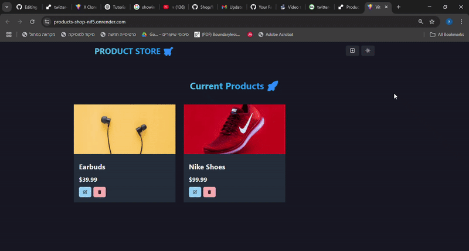

## 📌 Small Shop Project
A full-stack product management app that allows users to create and update products in a simple interface. Built with Chakra UI on the frontend and Express + MongoDB on the backend.

## 📺 Demo

## 🚀 Features
➕ Create new products via a responsive form

🔄 Update existing product information

💾 Data persistence using MongoDB and Mongoose

⚙️ Built-in state management with Zustand

🎨 Modern and accessible UI using Chakra UI

## 🧑‍💻 Tech Stack
Frontend

React, Vite, Chakra UI (@chakra-ui/react, @chakra-ui/icons), Emotion (@emotion/react, @emotion/styled), Zustand, React Router DOM, React Icons

Backend

Node.js, Express, MongoDB (Mongoose), dotenv

Other Tools

Postman, cross-env, nodemon

## 🔐 Environment Variables
MONGO_URI=

PORT=

## 📦 Installation

From the root folder:

- npm run build 
- npm run start (for production)

## 🙏 Acknowledgments
This project was built as part of my personal learning path. I want to thank the online developer community and the many tutorials, videos, and blog posts that helped guide and inspire me throughout the process of building this app.

Thanks for checking it out! 🌿

